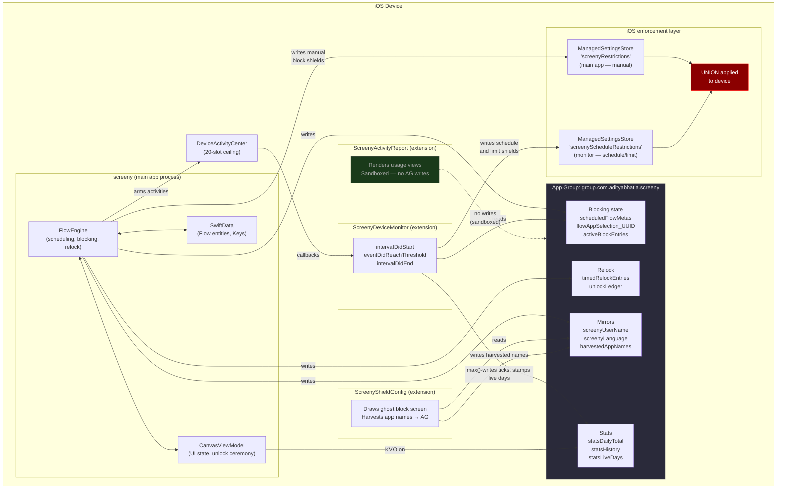
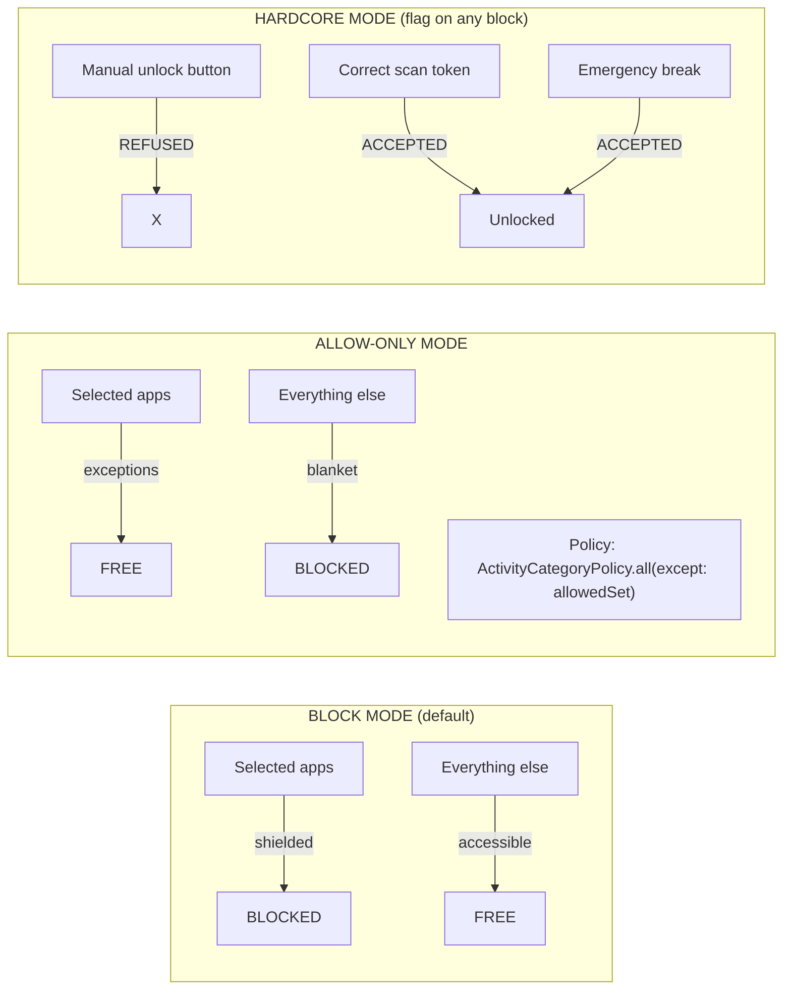

# Screeny Architecture — CTO Technical Reference

**Branch:** `staging-build18` · **Build:** 24 · **Target iOS:** 17.4+  
**Last updated:** 2026-09-08

---

## How to read this book

This documentation is structured for a CTO who needs to understand every corner of the system — not just the happy path. Each chapter is self-contained, but the reading order below builds context progressively.

Start with **Chapter 1** (constraints) before everything else. Apple's Screen Time API is a black box with hard walls; understanding those walls first prevents misinterpreting every other design decision as a mistake.

---

## Table of Contents

| # | Chapter | What you learn |
|---|---------|---------------|
| [01](01-apple-api-constraints.md) | **Apple Screen Time API Constraints** | The fundamental walls. What the API can and cannot do. Every known restriction, with Apple documentation links. |
| [02](02-project-anatomy.md) | **Project Anatomy** | Every file, every target, every folder. The complete map of the codebase. |
| [03](03-data-model-and-ipc.md) | **Data Model & Inter-Process Communication** | SwiftData models, App Group keys, the IPC contract between all four processes. |
| [04](04-blocking-engine.md) | **Blocking Engine (FlowEngine)** | How blocking, unblocking, schedules, usage limits, and re-locks work end to end. |
| [05](05-extensions.md) | **Extension Architecture** | Deep dive into all three extensions: DeviceMonitor, ShieldConfig, ActivityReport. |
| [06](06-stats-system.md) | **Statistics System** | The tick-ladder proxy, the five-cause accuracy problem, the v4 fix, and what still can't be solved. |
| [07](07-ui-architecture.md) | **UI Architecture** | Navigation, screens, component library, interaction patterns. |
| [08](08-blockers-and-bugs.md) | **Known Blockers & Active Bugs** | Unreliable auto-blocking, premature blocking before limit, stats inaccuracy — root causes and current status. |
| [09](09-alternatives-explored.md) | **Alternatives Explored & Rejected** | Every design fork, why the road not taken was left, and what it would cost to go back. |
| [10](10-roadmap.md) | **Roadmap & Open Work** | Pending device-tests, follow-up features, and the backlog. |
| [11](11-diagrams.md) | **Diagrams Reference** | All system diagrams: process architecture, data model, state machine, slot budget, stats ladder, IPC flows, onboarding. |

---

## Quick-reference: the three hard constraints

Before reading anything else, internalize these three facts. They explain ~80% of the seemingly odd architectural decisions.

**1. The app cannot read Screen Time usage data directly.**  
`DeviceActivityFilter` and `DeviceActivityReport` can show usage *in a sandboxed extension view*, but no API lets the main app receive a number like "Instagram: 45 minutes today". Screeny works around this by registering threshold events and counting how many fire.

**2. The DeviceActivity extension has a 20-activity ceiling.**  
`DeviceActivityCenter` refuses more than 20 simultaneously registered activities. Screeny uses 18 (leaving 2 as headroom), split among relocks, schedules, daily limits, coach pacing, and the stats tick ladder.

**3. Extensions cannot communicate back to the main app over standard sockets.**  
The only data channel is the App Group UserDefaults (`group.com.adityabhatia.screeny`). The main app writes schedules in; the monitor extension writes tick data and lock state out; the shield extension reads names out.

---

## System overview diagram

---

## Key decisions at a glance

| Decision | What was chosen | Why | What was rejected |
|---|---|---|---|
| Usage measurement | Tick-ladder threshold proxy | No direct read API exists in Screen Time | Real-time polling (impossible), DeviceActivityReport extension (no touch, no writes on device) |
| Separate `ManagedSettingsStore` per process | `screenyRestrictions` (app) + `screenyScheduleRestrictions` (ext) | Each store is fully owned by one process; no write conflicts | Single shared store — each write would wipe the other's state |
| IPC channel | App Group UserDefaults only | The only OS-supported channel between sandbox processes | XPC services (unavailable under FamilyControls), network sockets (no entitlement) |
| Flow persistence | SwiftData (main app only) | Simplest Swift-native persistence; no extension needs to write flows | CoreData (heavier), CloudKit (sync complexity), plain JSON files |
| DeviceActivity slot budget | 20 ceiling, 18 usable, priority queue | Hard OS limit, cannot be raised; priority prevents silent failure | No priority (stats could silently fail to arm if flows exhaust the budget) |
| `includesPastActivity: true` | Enabled | Without it, daily limits reset to zero at midnight and can't count cross-midnight usage | Disabled — premature blocking (Mac usage inflates phone limit) is the price |
| Stats chart rendering | App-drawn (SwiftUI, from tick history) | Touch events work, instant cache, no cold start | Extension-drawn (DeviceActivityReport) — no touch events, no App Group writes on device, 2-5s cold start |
| External dependencies | Zero (no SPM, no CocoaPods) | App Store reliability; entitlement app reviews are strict about third-party code | Any third-party library — possible App Store review flag |

---

## Blocking modes overview

---

*All chapters use the same notation: code paths are written as `TypeName.methodName` and App Group keys appear as `"quoted_strings"`. See [Chapter 11](11-diagrams.md) for all full Mermaid diagrams.*
