# Chapter 11 — Diagrams Reference

All system diagrams in one place. Every diagram is rendered from the Mermaid blocks below — open this file in any Mermaid-aware renderer (GitHub, Obsidian, VS Code + Mermaid preview) to see them visually.

---

## Diagram 1 — Four-process system architecture

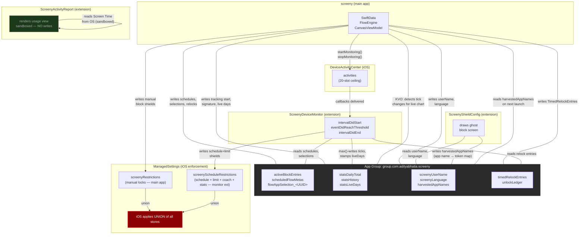

---

## Diagram 2 — Flow data model

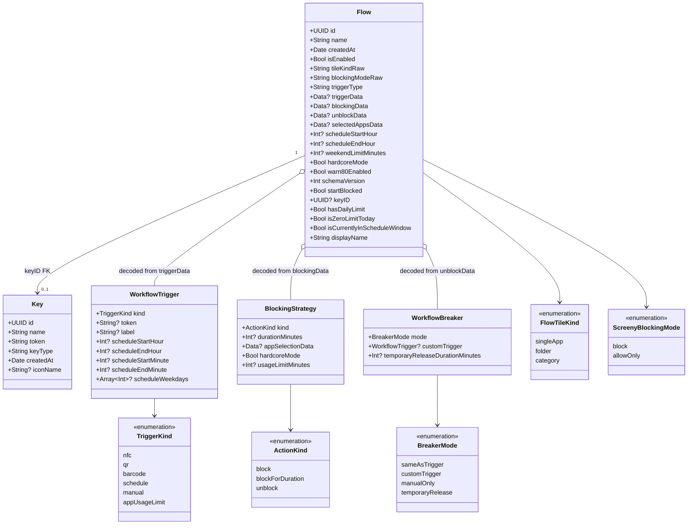

---

## Diagram 3 — Blocking state machine

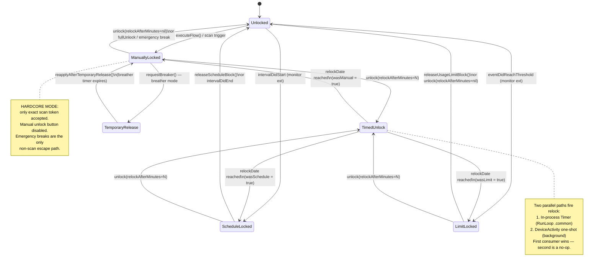

---

## Diagram 4 — DeviceActivity slot budget (20-slot ceiling)

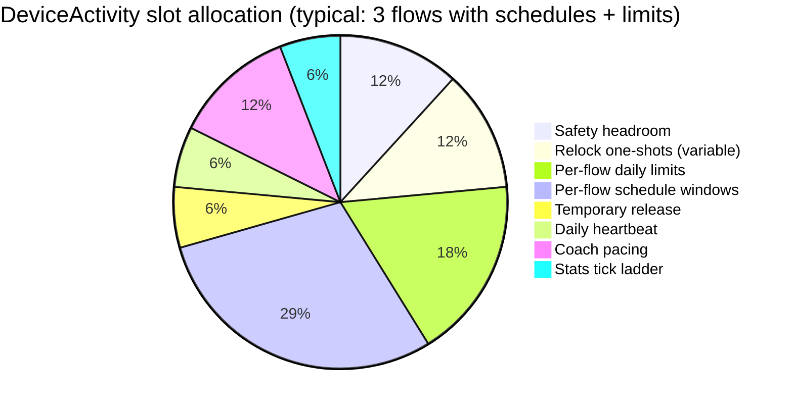

Priority order (highest → lowest). When slots are exhausted, lower-priority features are silently not armed:

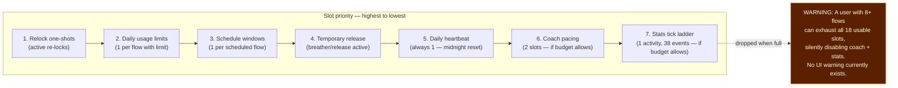

---

## Diagram 5a — Stats tick ladder v4 (threshold structure)

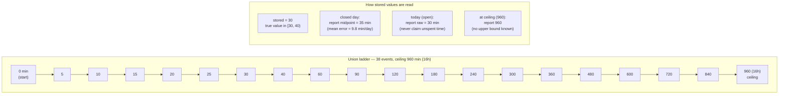

## Diagram 5b — Stats tick event sequence

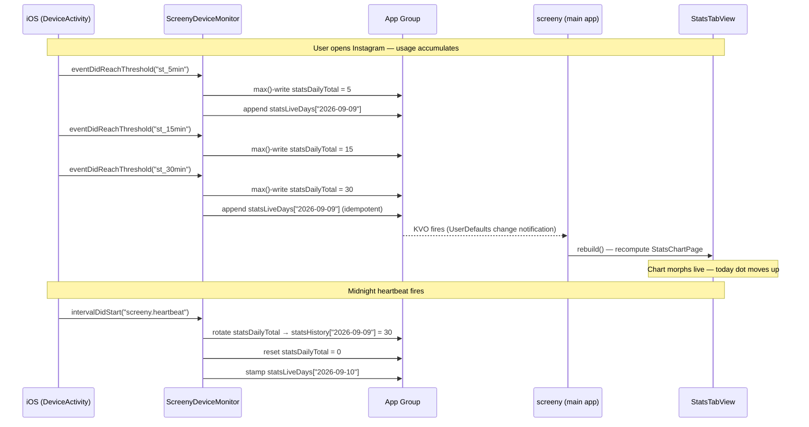

---

## Diagram 6 — IPC data flows (complete sequence)

```mermaid
sequenceDiagram
  participant MainApp as screeny (main app)
  participant AG as App Group
  participant DAC as DeviceActivityCenter
  participant MonExt as ScreenyDeviceMonitor
  participant ShieldExt as ScreenyShieldConfig
  participant ReportExt as ScreenyActivityReport

  rect rgb(30, 50, 30)
    Note over MainApp,MonExt: 1. Schedule setup
    MainApp->>AG: write scheduledFlowMetas[flowID]
    MainApp->>AG: write flowAppSelection_<UUID>
    MainApp->>DAC: startMonitoring("screeny.flow.<uuid>", schedule)
    Note over DAC: activity registered (uses 1 slot)
  end

  rect rgb(30, 30, 60)
    Note over DAC,MonExt: 2. Schedule window fires
    DAC->>MonExt: intervalDidStart("screeny.flow.<uuid>")
    MonExt->>AG: read scheduledFlowMetas (all flows)
    MonExt->>AG: read flowAppSelection_<UUID> (each in-window flow)
    MonExt->>MonExt: buildUnionShield() — union of all in-window flows
    MonExt->>MonExt: ManagedSettingsStore("screenyScheduleRestrictions").shieldSettings = ...
    Note over MonExt: block applied to device
  end

  rect rgb(50, 30, 30)
    Note over MonExt,MainApp: 3. Stats tick
    DAC->>MonExt: eventDidReachThreshold("st_30min")
    MonExt->>AG: max()-write statsDailyTotal = 30
    MonExt->>AG: append statsLiveDays[today]
    AG-->>MainApp: KVO fires
    MainApp->>MainApp: StatsTabView.rebuild()
  end

  rect rgb(50, 40, 10)
    Note over ShieldExt,MainApp: 4. App name harvest
    ShieldExt->>AG: read harvestedAppNames["<token-key>"]
    Note over ShieldExt: key absent — name unknown
    ShieldExt->>ShieldExt: Application(token:).localizedDisplayName → "Instagram"
    ShieldExt->>AG: write harvestedAppNames["<token-key>"] = "Instagram"
    Note over MainApp: next launch
    MainApp->>AG: read harvestedAppNames
    MainApp->>MainApp: ScreenyAppNames cache updated
  end

  rect rgb(20, 40, 50)
    Note over MainApp,MonExt: 5. Timed relock
    MainApp->>AG: write TimedRelockEntry{flowID, relockDate, wasManual:true}
    MainApp->>DAC: startMonitoring("screeny.relock.<uuid>", one-shot at relockDate)
    Note over DAC: timer also armed in-process (RunLoop .common)
    DAC->>MonExt: intervalDidEnd("screeny.relock.<uuid>")
    MonExt->>AG: read TimedRelockEntry
    MonExt->>MonExt: re-apply wasManual block → ManagedSettingsStore
    MonExt->>AG: write UnlockLedgerEntry{kind: .relock}
    MonExt->>AG: delete TimedRelockEntry (consumed)
  end

  rect rgb(10, 10, 40)
    Note over ReportExt: 6. Activity Report (sandboxed)
    MainApp->>ReportExt: DeviceActivityReport view (remote render)
    ReportExt->>ReportExt: reads Screen Time data from OS
    ReportExt->>ReportExt: renders usage card SwiftUI view
    Note over ReportExt: CANNOT write to App Group\nCANNOT receive touch events
  end
```

---

## Diagram 7 — Onboarding flow (11 steps)

```mermaid
flowchart TD
  START(["App first launch\nhasOnboarded = false"]) --> S1

  S1["Step 1\nSplash\n'Hey. I'm Screeny.'\nTap anywhere to begin"]
  S1 --> S2

  S2["Step 2\nName\nAsk for screenyUserName"]
  S2 --> S2_CHECK{Name entered?}
  S2_CHECK -->|"yes"| S3
  S2_CHECK -->|"skip / empty\n(not allowed)"| S2

  S3["Step 3\nHook\nGhost talks — sets the premise\n'I'll lock the apps you choose'"]
  S3 --> S4

  S4["Step 4\nScreen Time Permission\nOpal-style popup + gradient ring"]
  S4 --> S4_CHECK{Permission granted?}
  S4_CHECK -->|"granted"| S5
  S4_CHECK -->|"denied"| S4_RETRY["Retry / explain\nloop"]
  S4_RETRY --> S4

  S5["Step 5\nPick Apps\nFamilyActivityPicker embedded inline\nCategories stripped immediately"]
  S5 --> S6

  S6["Step 6\nDaily Limit\nBigNumberPicker — minutes per day\n0 = blocked all day"]
  S6 --> S7

  S7["Step 7\nSchedule\nTime range + weekday picker"]
  S7 --> S8

  S8["Step 8\nKey Type\nScan explanation:\n'One scan locks, next unlocks'"]
  S8 --> S9

  S9["Step 9\nNotifications Permission\nPopup replica + benefit rows"]
  S9 --> S9_CHECK{Permission granted?}
  S9_CHECK -->|"granted"| S10
  S9_CHECK -->|"denied (soft fail) — no block, just fewer features"| S10

  S10["Step 10\nDone\nPersonalized: 'You're set, &lt;name&gt;.'\nScreeny logo + hovering app icons"]
  S10 --> S11

  S11["Step 11\nHold-to-Commit Ceremony\nHold 6 s to activate the first Flow\n'Starting your streak...'"]
  S11 --> END

  END(["hasOnboarded = true\nStreak = day 1\nMain shell visible"])

  style S4_RETRY fill:#5a2000,stroke:#f80,color:#ffd
  style END fill:#1a3a1a,stroke:#4a8,color:#afa
```

---

## Diagram 8 — Shield store composition

How two independent `ManagedSettingsStore` instances combine to produce the final block:

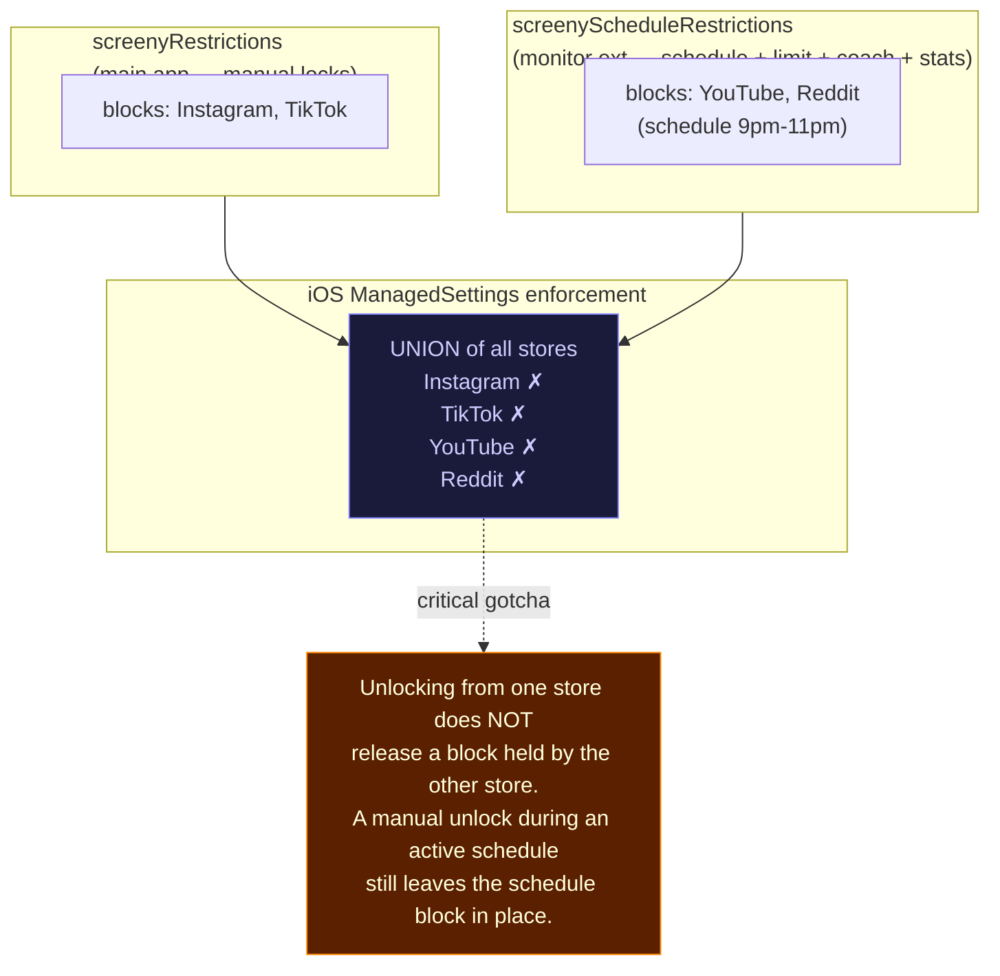

---

## Diagram 9 — Stats accuracy: the five causes

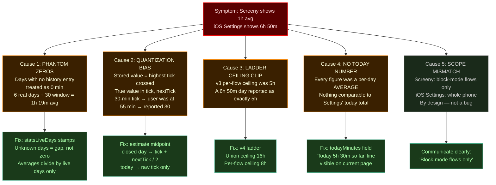
